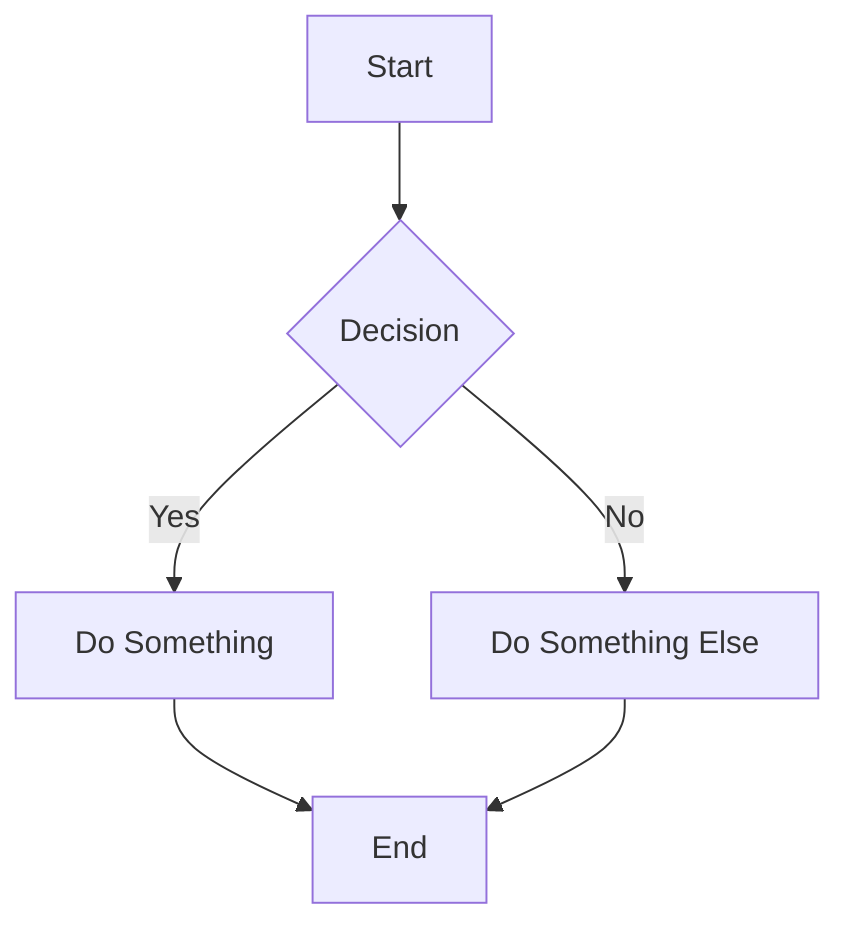

# AI Guide: Documentation Creation Guide

This guide provides instructions for AI systems on how to create and organize documentation in this NextDocs repository following established patterns and conventions.

## Repository Structure

### Required Directory Structure

```
project-root/
├── docs/              # Main documentation (REQUIRED)
│   ├── _meta.json     # Project listings (REQUIRED)
│   ├── project-a/     # Individual project documentation
│   │   ├── _meta.json # Navigation configuration
│   │   ├── index.md   # Project homepage
│   │   └── [sections]/ # Organized content sections
│   └── project-b/     # Another project
│       ├── _meta.json
│       ├── index.md
│       └── [sections]/
├── blog/              # Blog posts (optional)
│   ├── 2024/          # Year-based organization (organizational only)
│   │   ├── 01/        # Month subdirectories (organizational only)
│   │   │   └── post-title.md
│   │   └── 12/
│   │       └── another-post.md
│   └── 2025/
│       └── 01/
├── authors/           # Author profiles (shared, root level)
│   ├── john-doe.json
│   └── sarah-smith.json
└── api-specs/         # API documentation (optional)
    ├── user-api/      # API spec subdirectories
    │   └── v1.0.0.yaml # OpenAPI specification (YAML only)
    └── admin-api/
        └── v2.0.0.yaml
```

### Content Types

- **docs/[project-name]/**: Project-specific documentation (always required, organized by project)
- **blog/**: Time-based blog posts organized by year/month subdirectories (dates come from frontmatter, not path)
- **authors/**: Author profile JSON files (shared, root level)
- **api-specs/**: OpenAPI/Swagger YAML specifications only (index.md files are treated as regular docs)

## Creating Documentation Sections

### 1. Directory Organization

- Use **lowercase with hyphens** for all directories: `user-guide/`, `api-reference/`, `getting-started/`
- Each directory MUST contain an `index.md` file as the section homepage
- Store section-specific images in an `_img/` subdirectory within each section

### 2. File Naming Conventions

- Use **lowercase with hyphens** for all files: `quick-start.md`, `installation-guide.md`
- Always use `.md` extension for Markdown files
- Keep names short but descriptive
- Avoid spaces, underscores, or special characters

### 3. Example Structure

```
docs/
├── my-project/        # Project-specific directory
│   ├── _meta.json
│   ├── index.md
│   ├── getting-started/
│   │   ├── _meta.json
│   │   ├── index.md
│   │   ├── installation.md
│   │   ├── quick-start.md
│   │   └── _img/
│   │       └── setup-diagram.png
│   └── user-guide/
│       ├── _meta.json
│       ├── index.md
│       ├── basic-features.md
│       ├── advanced-features.md
│       └── _img/
│           └── interface-screenshot.png
└── another-project/   # Additional project
    ├── _meta.json
    ├── index.md
    └── api-reference/
        ├── _meta.json
        ├── index.md
        └── endpoints.md
```

## Navigation Configuration (`_meta.json`)

### Root Projects Listing (REQUIRED)

The root `docs/` directory MUST contain a `_meta.json` file that lists all projects:

**Location**: `docs/_meta.json`

```json
{
  "my-project": {
    "title": "My Project",
    "icon": "Package",
    "description": "My Project — a comprehensive solution for managing widgets and gadgets. See the project repository for details."
  },
  "another-project": {
    "title": "Another Project",
    "icon": "Rocket",
    "description": "Another Project — innovative tools for modern development workflows."
  }
}
```

**Required fields for each project**:

- `title`: Human-readable project name
- `icon`: Lucide icon name (see Available Icons section below)
- `description`: Brief description of the project (1-2 sentences)

### Project Navigation

Every directory containing documentation MUST have a `_meta.json` file that controls:

- Navigation order and hierarchy within that project/section
- Display titles (can differ from filenames)
- Icons for visual navigation

**Note**: Each project under `/docs/` has its own navigation structure defined by its `_meta.json` files.

### Format

```json
{
  "filename-without-extension": {
    "title": "Human-Readable Display Title",
    "icon": "IconName"
  }
}
```

### Example `_meta.json`

**IMPORTANT**: Do NOT include `index` entries in `_meta.json` - they are ignored by the parser. The index.md file is automatically used as the section homepage.

```json
{
  "installation": {
    "title": "Installation Guide",
    "icon": "Download"
  },
  "quick-start": {
    "title": "Quick Start",
    "icon": "Zap"
  },
  "advanced-features": {
    "title": "Advanced Features",
    "icon": "Settings"
  }
}
```

### Available Icons

Icons use the **Lucide** icon library. You can use any Lucide icon name (PascalCase format).

**Common icons include**: `Home`, `BookOpen`, `Zap`, `Download`, `Settings`, `Code`, `User`, `FolderTree`, `FileText`, `Newspaper`, `Rocket`, `Info`, `Shield`, `Database`, `Globe`, `Search`, `Smile`, `Package`, `Terminal`, `Wrench`, `Star`, `Heart`, `CheckCircle`, `AlertCircle`, `Lock`, `Unlock`, `Calendar`, `Clock`, `Mail`, `Phone`, `MapPin`, `Image`, `Video`, `Music`, `Camera`, `Headphones`

**Reference**: Visit [Lucide Icons](https://lucide.dev/icons/) for the complete icon catalog. Use the icon name exactly as shown (PascalCase).

## Creating Documentation Files

### File Structure

Each documentation file should:

1. Start with a clear H1 heading (`# Title`)
2. Include a brief description of the content
3. Use consistent heading hierarchy (H1 → H2 → H3 → etc.)
4. Include relevant examples and code snippets

### Example Documentation File

```markdown
# Feature Documentation

Brief description of what this feature does and why it's important.

## Getting Started

Step-by-step instructions...

### Prerequisites

List what users need before starting:
- Requirement 1
- Requirement 2

### Installation

\`\`\`bash
npm install feature-name
\`\`\`

## Usage Examples

Provide practical examples...

## Configuration

Explain configuration options...
```

## Document Frontmatter (YAML)

Every documentation Markdown file should include a YAML frontmatter block at the top. The following fields are **actually processed** by NextDocs:

### Processed Frontmatter Fields

```yaml
---
title: Accounts Payable Processes
description: Used as excerpt fallback if excerpt not provided
excerpt: Brief summary that appears in listings (preferred over description)
author: gareth-cheyne
category: dynamics-365-bc
tags: [finance, accounting, bc]
restricted: true
restrictedRoles:
  - SGRP-CRM-Finance-Franchisee
  - SGRP-CRM-*
---
```

### Field Descriptions

| Field | Type | Description |
|-------|------|-------------|
| `title` | string | Human-readable page title (falls back to filename if not provided) |
| `excerpt` | string | Short summary for listings (preferred) |
| `description` | string | Used as excerpt fallback; also used for SEO |
| `author` | string | Author ID (must match a file in `/authors/`) |
| `category` | string | Auto-extracted from first folder after `/docs/` if not specified |
| `tags` | array | Array of tags for filtering (supports `[a, b]` or YAML list) |
| `restricted` | boolean | If `true`, the page is access-restricted |
| `restrictedRoles` | array | List of roles that may access the page |

**Note**: Fields like `type` and `source` can be included in frontmatter for your own reference, but they are NOT processed or stored by NextDocs.

Images referenced by documentation should be stored in the section's `_img/` subdirectory and referenced in Markdown as ``.

---

## Creating API Specifications

### Directory Structure

API specifications are **YAML files only**. Place them in subdirectories within `/api-specs/`:

```
api-specs/
├── user-api/
│   └── v1.0.0.yaml    # OpenAPI specification
├── admin-api/
│   └── v2.0.0.yaml
└── payment-api/
    └── v1.0.0.yaml
```

### Important Notes

- **Only YAML files are processed** (`.yaml` or `.yml` extensions)
- `index.md` files in api-specs directories are treated as regular documentation, NOT as API specs
- Metadata is extracted from the YAML: `info.title`, `info.version`, `info.description`
- Slug is auto-generated from filename (version suffix like `-v1.0.0` is stripped)

### Example API Specification

```yaml
openapi: 3.0.3
info:
  title: User API
  description: API for managing user accounts and authentication
  version: 1.0.0
servers:
  - url: https://api.example.com/v1
    description: Production server
paths:
  /users:
    get:
      summary: List all users
      responses:
        '200':
          description: OK
```

## Creating Blog Posts

### Location and Naming

- Place blog posts in `/blog/YYYY/MM/` directory structure
- Use naming convention: `title-slug.md`
- Examples:
  - `/blog/2024/12/new-feature-release.md`
  - `/blog/2024/11/getting-started-guide.md`
  - `/blog/2025/01/year-review.md`

**IMPORTANT**: The YYYY/MM/ directory structure is **purely organizational**. Publication dates are determined **only from frontmatter fields**, not from the file path.

### Required Frontmatter

Every blog post MUST include frontmatter with a date field:

```yaml
---
title: Your Blog Post Title
author: author-id
publishedAt: 2024-12-22T10:30:00Z
category: tutorials
tags: [tag1, tag2, tag3]
excerpt: Brief 1-2 sentence description that appears in listings
---

Blog post content starts here...
```

### Fields Explained

| Field | Type | Required | Description |
|-------|------|----------|-------------|
| `title` | string | Yes | The display title of the blog post |
| `author` | string | Yes | Must match an author file in `/authors/` (without .json) |
| `publishedAt` | datetime | **Yes** | ISO format: `2024-12-22T10:30:00Z`. Also accepts `date` or `published` |
| `category` | string | No | Group posts (tutorials, news, updates, announcements) |
| `tags` | array | No | Array of relevant tags for filtering |
| `excerpt` | string | No | Short summary (auto-generated from content if not provided) |

### Optional Blog Fields

- **draft** or **isDraft**: Set to `true` to hide from publication (also checked via `status: draft`)
- **description**: SEO meta description (used as excerpt fallback)

## Creating Author Profiles

### Location

Author profiles are JSON files stored in the root `/authors/` directory:

```
authors/john-doe.json
authors/sarah-smith.json
authors/tech-team.json
```

**Note**: Files named `_meta.json` or `index.json` are ignored.

### Author File Format

```json
{
  "name": "John Doe",
  "email": "john.doe@example.com",
  "title": "Senior Developer",
  "bio": "Full-stack developer with 10 years of experience in web technologies.",
  "avatar": "/img/authors/john-doe.jpg",
  "location": "Sydney, Australia",
  "joinedDate": "2020-01-15",
  "social": {
    "linkedin": "https://linkedin.com/in/johndoe",
    "github": "https://github.com/johndoe",
    "website": "https://johndoe.dev"
  }
}
```

### Field Reference

| Field | Type | Required | Description |
|-------|------|----------|-------------|
| `name` | string | **Yes** | Full name of the author |
| `email` | string | **Yes** | Contact email |
| `title` | string | No | Professional title or role |
| `bio` | string | No | Brief professional description |
| `avatar` | string | No | Path to profile image |
| `location` | string | No | Geographic location |
| `joinedDate` | string | No | Date joined (YYYY-MM-DD format) |
| `social` | object | No | Social links (see below) |

### Supported Social Links

- `linkedin`: LinkedIn profile URL
- `github`: GitHub profile URL
- `website`: Personal website URL

**Note**: `twitter` is NOT supported by NextDocs.

---

## Access Restrictions

NextDocs supports document-level and inline content restrictions based on user roles/groups.

### Document-Level Restrictions

Restrict entire documents using frontmatter:

```yaml
---
title: Confidential Report
restricted: true
restrictedRoles:
  - SGRP-CRM-Admin
  - SGRP-Finance-*
  - SGRP-Sales-Manager
---
```

### Wildcard Role Matching

Use `*` wildcard to match multiple roles:

| Pattern | Matches |
|---------|---------|
| `SGRP-CRM-*` | `SGRP-CRM-Admin`, `SGRP-CRM-User`, `SGRP-CRM-Manager` |
| `SGRP-*-Admin` | `SGRP-Sales-Admin`, `SGRP-Finance-Admin` |
| `*-Manager` | Any role ending in `-Manager` |

### Access Rules

- **Admins**: Always see all content (with visual indicators)
- **Unauthenticated users**: Cannot access restricted content
- **Authenticated users**: Must match at least one `restrictedRoles` entry
- **No restrictions**: Everyone with authentication can access

---

## Inline Content Variants

Show different content to different user groups within the same document.

### Syntax

```markdown
# Main Document Title

This content is visible to everyone.

!variant!# SGRP-CRM-Admin
This section only appears for CRM Admins.

You can include any markdown here:
- Lists
- **Bold text**
- Code blocks
!endvariant!

!variant!# SGRP-Finance-*
This section appears for any Finance group member.
!endvariant!

Back to public content here.
```

### How Variants Work

| User Type | Behavior |
|-----------|----------|
| Matching role | Sees variant content inline |
| Non-matching role | Variant content is removed |
| Admin | Sees ALL variants with visual blockquote markers showing the role |

### Variant Guidelines

- Use for role-specific instructions, pricing, or sensitive details
- Multiple variants can exist in one document
- Variants support full markdown (headers, lists, code, images)
- Keep variant sections focused and concise

---

## Release Blocks

Announce releases targeted to specific teams with automatic "NEW" badges.

### Syntax

```markdown
:::release
teams: CRM, POS, Finance
version: 2024.12.15.1
---
### What's New
- Feature A added
- Bug fix for issue B
- Performance improvements

### Breaking Changes
- API endpoint renamed
:::
```

### Fields

| Field | Format | Description |
|-------|--------|-------------|
| `teams` | Comma-separated | Target teams (case-insensitive) |
| `version` | `yyyy.mm.dd.sub` | Version number (date extracted automatically) |

### Features

- **"NEW" badge**: Shows automatically for releases < 7 days old
- **Team subscriptions**: Users can subscribe to team release notifications
- **Date extraction**: Version number determines release date
- Supports full markdown content inside the block

---

## Markdown Features

### Mermaid Diagrams

Create diagrams using Mermaid syntax:

````markdown

````

**Features:**
- Client-side rendering with dark/light theme support
- Fullscreen view with maximize button
- Error handling with fallback display

**Supported diagram types:** flowchart, sequence, class, state, ER, gantt, pie, journey

### Inline Icons

#### Lucide Icons

Use `:icon-name:` syntax (auto-converts to PascalCase):

```markdown
Click the :settings: icon to configure.
Use :arrow-right: to navigate forward.
The :check-circle: indicates success.
```

#### Fluent UI Icons

Use `:#fluentui icon-name:` or `:icon-name20Regular:` syntax:

```markdown
Click :#fluentui settings: to open preferences.
The :document20Regular: icon represents files.
```

**Icons work in:** Headings, paragraphs, lists, bold/italic text

### Video Support

Videos are auto-detected by extension and rendered with controls:

```markdown


```

**Supported formats:** `.mp4`, `.webm`, `.ogg`, `.avi`, `.mkv`, `.mov`, `.flv`, `.wmv`, `.mpg`, `.mpeg`, `.m4v`

**Features:**
- Interactive controls (play, pause, volume, fullscreen)
- Responsive sizing
- Authentication required (secure serving)

### Code Blocks

````markdown
```javascript
// Language badge shown in corner
// Copy button with visual feedback
const greeting = "Hello, World!";
console.log(greeting);
```
````

**Features:**
- Syntax highlighting (Prism)
- Language badge display
- One-click copy button
- Dark/light theme support

### Tables (GFM)

```markdown
| Feature | Status | Notes |
|---------|--------|-------|
| Auth | Done | Azure AD |
| Search | Done | Full-text |
```

### User Mentions

Link to user profiles:

```markdown
Contact user:john-doe for more information.
```

---

## Content Creation Workflow

### For New Projects

1. **Create root projects listing** if it doesn't exist: `docs/_meta.json`
2. Add your project entry to `docs/_meta.json` with title, icon, and description
3. Create project directory under `/docs/[project-name]/`
4. Create project `_meta.json` file with navigation structure (do NOT include index entry)
5. Add `index.md` as the project homepage
6. Create content sections as needed

### For Documentation Sections

1. Create or identify the project directory under `/docs/[project-name]/`
2. Create content directories with appropriate lowercase-hyphen naming
3. Add `index.md` as the section homepage
4. Create the `_meta.json` file with navigation structure (exclude index)
5. Add individual content files following naming conventions
6. Create `_img/` subdirectory for section-specific images

### For Blog Posts

1. Create author profile in `/authors/` if it doesn't exist
2. Create year directory `/blog/YYYY/` if it doesn't exist
3. Create month directory `/blog/YYYY/MM/` if it doesn't exist
4. Create blog post with title naming: `title-slug.md`
5. Include complete frontmatter **with publishedAt date field**
6. Write content following markdown best practices

### For Authors

1. Create JSON file in `/authors/` using author-id as filename
2. Include required fields: `name`, `email`
3. Add optional fields as appropriate (title, bio, avatar, location, social links)

### For API Specifications

1. Create subdirectory in `/api-specs/` with descriptive name (e.g., `user-api/`)
2. Add YAML file with OpenAPI specification (e.g., `v1.0.0.yaml`)
3. Ensure `info.title`, `info.version`, and `info.description` are set in YAML
4. Optionally add documentation files to `/docs/` to accompany the spec

## Best Practices

### Content Organization

- Group related content in logical directories
- Use clear, descriptive section names
- Maintain consistent depth (avoid too many nested levels)
- Always provide an `index.md` for each directory

### Writing Style

- Use clear, concise language
- Include practical examples
- Structure content with consistent heading hierarchy

### Technical Guidelines

- Always validate JSON files for proper syntax
- **Internal links**: Use root-relative paths starting with `/` (omit the `.md` extension), e.g., `[Quick Start](/getting-started/quick-start)`
- **Images**: Reference section images in the `_img/` subdirectory (relative to the doc file), e.g., ``
- Test all code examples before publishing
- Ensure all `_meta.json` files reference actual existing files

### Maintenance

- Keep navigation menus logical and not too deep
- Update `_meta.json` when adding or removing files
- Maintain consistency in naming conventions across all content
- Regular review of content organization for improvements

## Validation Checklist

Before creating content, ensure:

- [ ] Root `docs/_meta.json` exists with project listings
- [ ] New project is added to root `docs/_meta.json` (if creating new project)
- [ ] Project directory exists under `/docs/[project-name]/`
- [ ] Directory uses lowercase-hyphen naming
- [ ] Project-level `_meta.json` exists and is valid JSON
- [ ] `_meta.json` does NOT contain an "index" entry
- [ ] All referenced files in `_meta.json` actually exist
- [ ] Author profiles exist for all blog post authors (with name and email)
- [ ] Blog post frontmatter includes `publishedAt` date field
- [ ] Images are stored in appropriate `_img/` subdirectories
- [ ] File naming follows established conventions
- [ ] Navigation structure remains logical and user-friendly

---

## Technical Specifications

### File Encoding and Format

- **Encoding**: All files must be UTF-8
- **Line Endings**: Use LF (Unix-style) line endings
- **Markdown**: CommonMark specification with GitHub Flavored Markdown extensions

### Image Guidelines

- **Supported Formats**: PNG, JPG, WebP, SVG
- **Recommended Size**: Maximum 1920px width for screenshots
- **Optimization**: Compress images for web (aim for <500KB per image)
- **Alt Text**: Always include descriptive alt text for accessibility
- **Naming**: Use lowercase-hyphen naming for image files

### Link Formatting

- **Internal Links**: Use root-relative paths starting with `/` for documentation pages (omit the `.md` extension)
- **Cross-Project**: Use root-level project paths, e.g., `/docs/other-project/section`
- **External Links**: Always use HTTPS when possible
- **Anchors**: Use lowercase-hyphen format for heading anchors

### Code Block Standards

```markdown
\`\`\`language-identifier
// Always specify language for syntax highlighting
const example = "properly formatted code";
\`\`\`
```

**Supported Languages**: `javascript`, `typescript`, `python`, `bash`, `json`, `yaml`, `markdown`, `html`, `css`, `sql`, `dockerfile`

### URL and Slug Generation

- **Auto-generated**: URLs are created from file paths and project structure
- **Format**: `/docs/project-name/section/filename` (without .md extension)
- **Special Characters**: Automatically converted to hyphens in URLs
- **Case**: All URLs are lowercase

## Content Guidelines

### Writing Style

- **Tone**: Clear, concise, and helpful
- **Person**: Use second person ("you") for instructions
- **Active Voice**: Prefer active voice over passive
- **Headings**: Use sentence case (not title case)

### Formatting Standards

- **Bold**: Use `**text**` for emphasis and UI elements
- **Italics**: Use `*text*` for technical terms or emphasis
- **Code**: Use `` `code` `` for inline code, commands, and filenames
- **Lists**: Use `-` for unordered lists, `1.` for ordered lists
- **Tables**: Always include headers and align columns consistently

### Accessibility Requirements

- **Heading Hierarchy**: Use proper H1 → H2 → H3 progression (no skipping levels)
- **Alt Text**: Required for all images with descriptive content
- **Link Text**: Use descriptive text, avoid "click here" or "read more"
- **Color**: Don't rely solely on color to convey information

## Content Restrictions

### What NOT to Include

- **Sensitive Data**: No API keys, passwords, or personal information
- **Copyrighted Material**: Only use original content or properly licensed material
- **Temporary URLs**: Avoid localhost or temporary links in examples
- **Hardcoded Dates**: Use relative dates ("recently", "in 2024") unless historically significant

### Error Prevention

- **File Conflicts**: Check if files already exist before creating
- **Broken Links**: Verify all internal links point to existing files
- **Missing Dependencies**: Ensure referenced authors, images, and files exist
- **Duplicate Content**: Avoid creating redundant documentation

## Workflow Considerations

### Before Creating Content

1. **Survey Existing**: Check if similar content already exists
2. **Plan Structure**: Determine the best project and section placement
3. **Verify Resources**: Ensure authors, images, and references are available
4. **Consider Audience**: Match content complexity to intended users

### Content Lifecycle

- **Draft State**: Use `draft: true` in frontmatter for work-in-progress
- **Review Process**: Content should be complete and tested before publishing
- **Updates**: When updating existing content, maintain backward compatibility
- **Archives**: Don't delete old content; move to archive sections if needed

### Integration Points

- **Search**: Content is automatically indexed for search functionality
- **Navigation**: Appears in menus based on `_meta.json` configuration
- **Cross-references**: Can be linked from other projects and sections
- **API Integration**: API specs automatically generate interactive documentation
