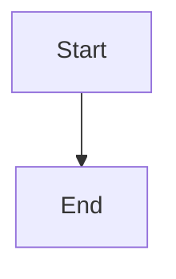

# NextDocs Documentation Conventions

When helping create documentation, follow these NextDocs conventions.

## File & Directory Naming

- **Lowercase with hyphens**: `getting-started/`, `api-reference.md`
- **No spaces, underscores, or capitals**

## Directory Structure

```
docs/{project-slug}/
├── _meta.json           # Navigation config
├── index.md             # Project overview
├── getting-started/
│   ├── _meta.json
│   ├── index.md
│   └── {pages}.md
└── guides/
    ├── _meta.json
    └── {pages}.md
```

## _meta.json Format

For project root listing (`docs/_meta.json`):
```json
{
  "my-project": {
    "title": "My Project",
    "icon": "Package",
    "description": "Brief project description"
  }
}
```

For sections (`docs/my-project/_meta.json`):
```json
{
  "getting-started": {
    "title": "Getting Started",
    "icon": "Rocket"
  },
  "guides": {
    "title": "Guides",
    "icon": "BookOpen"
  }
}
```

**CRITICAL: Never include "index" in _meta.json - it's ignored by the parser!**

## Document Frontmatter

```yaml
---
title: Page Title
excerpt: Brief summary for listings
---
```

Optional fields: `author`, `tags`, `restricted`, `restrictedRoles`

## Common Icons (Lucide)

| Purpose | Icon |
|---------|------|
| Getting Started | `Rocket`, `Zap` |
| Installation | `Download`, `Package` |
| Configuration | `Settings`, `Wrench` |
| Guides | `BookOpen`, `Book` |
| API | `Code`, `Terminal` |
| Reference | `FileText`, `Database` |
| Security | `Shield`, `Lock` |

## Blog Posts

Location: `blog/YYYY/MM/slug.md`

Required frontmatter:
```yaml
---
title: Post Title
author: author-id
publishedAt: 2024-12-22T10:00:00Z
tags: [tag1, tag2]
excerpt: Brief summary
---
```

## Authors

Location: `authors/author-id.json`

```json
{
  "name": "Full Name",
  "email": "email@example.com",
  "title": "Role",
  "bio": "Brief bio"
}
```

## API Specs

Location: `api-specs/api-name/v1.0.0.yaml`

Only YAML files are processed (not index.md).

## Images & Media

### Images
- Store in `_img/` directories next to markdown files
- Supported formats: PNG, JPG, SVG, WebP
- Use descriptive filenames: `dashboard-overview.png` (not `image1.png`)
- Keep images under 500KB (compress before committing)
- Always include alt text: ``

### Videos
- Store in `_videos/` directories next to markdown files
- Supported formats: MP4 (recommended), WebM, OGG, AVI, MKV, MOV, FLV, MPEG
- Keep under 100MB per file
- Same markdown syntax: ``

### Structure Example
```
docs/my-project/
├── getting-started/
│   ├── _meta.json
│   ├── index.md
│   ├── _img/
│   │   ├── setup-wizard.png
│   │   └── dashboard.png
│   └── _videos/
│       └── walkthrough.mp4
```

> All media is automatically protected — requires user authentication to access.

## Nested Directories

You can nest sections multiple levels deep. Each level needs its own `_meta.json`:

```
docs/my-project/
├── _meta.json
├── guides/
│   ├── _meta.json
│   ├── index.md
│   └── advanced/
│       ├── _meta.json
│       ├── index.md
│       └── custom-workflows.md
```

Each `_meta.json` only lists its **direct children** (not grandchildren).

## Advanced Features

### Access Restrictions

Restrict entire pages to specific roles or AD groups:

```yaml
---
title: Admin Guide
restricted: true
restrictedRoles:
  - SGRP-Admin
  - SGRP-CRM-*
---
```

- Wildcard matching: `SGRP-CRM-*` matches `SGRP-CRM-Admin`, `SGRP-CRM-Users`, etc.
- Users without a matching role see a "restricted" message instead of content.

### Content Variants

Show different content to different roles **within the same page**:

```markdown
This paragraph is visible to everyone.

!variant!# SGRP-Admin
This section only appears for users in the SGRP-Admin group.
You can include any markdown here — headings, lists, code blocks.
!endvariant!

!variant!# SGRP-CRM-Users
This section only appears for CRM users.
!endvariant!

This paragraph is visible to everyone again.
```

Use variants when a single page needs role-specific instructions (e.g., admin setup vs. user setup).

### Release Blocks

Announce releases to specific teams. These render as styled announcement banners:

```markdown
:::release
teams: CRM, Finance
version: 2024.12.20.1
---
## What's New
- Added bulk import feature
- Fixed dashboard loading issue

## Breaking Changes
- API endpoint `/v1/old` removed — use `/v2/new`
:::
```

- `teams` — comma-separated list of teams who should see this release note
- `version` — the release version identifier
- Content between `---` and `:::` supports full markdown

### Mermaid Diagrams
````markdown

````

### Inline Icons
- Lucide: `:settings:`, `:rocket:`
- Fluent: `:#fluentui settings:`
