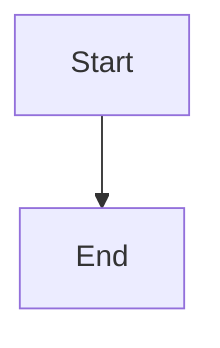

# NextDocs Documentation Conventions

When helping create documentation, follow these NextDocs conventions.

## File & Directory Naming

- **Lowercase with hyphens**: `getting-started/`, `api-reference.md`
- **No spaces, underscores, or capitals**

## Directory Structure

```
docs/{project-slug}/
├── _meta.json           # Navigation config
├── index.md             # Project overview
├── getting-started/
│   ├── _meta.json
│   ├── index.md
│   └── {pages}.md
└── guides/
    ├── _meta.json
    └── {pages}.md
```

## _meta.json Format

For project root listing (`docs/_meta.json`):
```json
{
  "my-project": {
    "title": "My Project",
    "icon": "Package",
    "description": "Brief project description"
  }
}
```

For sections (`docs/my-project/_meta.json`):
```json
{
  "getting-started": {
    "title": "Getting Started",
    "icon": "Rocket"
  },
  "guides": {
    "title": "Guides",
    "icon": "BookOpen"
  }
}
```

**CRITICAL: Never include "index" in _meta.json - it's ignored by the parser!**

## Document Frontmatter

```yaml
---
title: Page Title
excerpt: Brief summary for listings
---
```

Optional fields: `author`, `tags`, `restricted`, `restrictedRoles`

## Common Icons (Lucide)

| Purpose | Icon |
|---------|------|
| Getting Started | `Rocket`, `Zap` |
| Installation | `Download`, `Package` |
| Configuration | `Settings`, `Wrench` |
| Guides | `BookOpen`, `Book` |
| API | `Code`, `Terminal` |
| Reference | `FileText`, `Database` |
| Security | `Shield`, `Lock` |

## Blog Posts

Location: `blog/YYYY/MM/slug.md`

Required frontmatter:
```yaml
---
title: Post Title
author: author-id
publishedAt: 2024-12-22T10:00:00Z
tags: [tag1, tag2]
excerpt: Brief summary
---
```

## Authors

Location: `authors/author-id.json`

```json
{
  "name": "Full Name",
  "email": "email@example.com",
  "title": "Role",
  "bio": "Brief bio"
}
```

## API Specs

Location: `api-specs/api-name/v1.0.0.yaml`

Only YAML files are processed (not index.md).

## Advanced Features

### Access Restrictions
```yaml
restricted: true
restrictedRoles:
  - SGRP-Admin
  - SGRP-CRM-*
```

### Content Variants
```markdown
!variant!# ROLE-NAME
Content only for this role
!endvariant!
```

### Release Blocks
```markdown
:::release
teams: CRM, Finance
version: 2024.12.20.1
---
## What's New
- Feature description
:::
```

### Mermaid Diagrams
````markdown

````

### Inline Icons
- Lucide: `:settings:`, `:rocket:`
- Fluent: `:#fluentui settings:`
