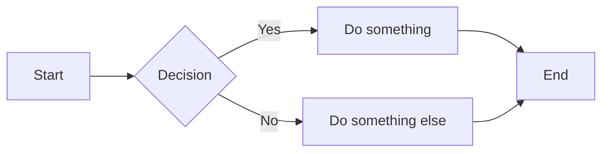

# NextDocs Documentation Skill

You are helping create or review documentation following NextDocs conventions.

## When to Use This Skill

Use this skill when:
- Creating a new documentation project structure
- Adding documentation pages, sections, or blogs
- Creating author profiles
- Configuring `_meta.json` navigation files
- Writing document frontmatter
- Using custom markdown blocks (tabs, steps, callouts, etc.)
- Adding API specifications
- Reviewing documentation for NextDocs compliance

## Quick Reference: Common Mistakes

| Don't | Do |
|-------|-----|
| Add H1 (`#`) in markdown body | Start with H2 (`##`) - title renders from frontmatter |
| Use `description` in frontmatter | Use `excerpt` (both work, but be consistent) |
| Include `"index"` in `_meta.json` | Omit index entries - parser ignores them |
| Forget `index.md` in subdirectories | Every folder needs `_meta.json` AND `index.md` |
| Use spaces/capitals in filenames | Use `lowercase-with-hyphens` |
| Skip the `excerpt` field | Always include - used in search and listings |

## File & Directory Naming

- **Lowercase with hyphens**: `getting-started/`, `api-reference.md`
- **No spaces, underscores, or capitals**

---

# Documentation Structure

## Directory Layout

```
docs/{project-slug}/
├── _meta.json           # Navigation config
├── index.md             # Project overview (REQUIRED)
├── getting-started/
│   ├── _meta.json
│   ├── index.md         # Section landing page (REQUIRED)
│   └── {pages}.md
└── guides/
    ├── _meta.json
    ├── index.md         # Section landing page (REQUIRED)
    └── {pages}.md
```

## Index Files (Required)

**Every subdirectory MUST have an `index.md` file.** This serves as the landing page.

### With Section Content

```yaml
---
title: Getting Started
excerpt: Learn how to set up and configure the application
---

Welcome to the Getting Started guide. This section covers installation,
initial configuration, and your first steps with the platform.

## Prerequisites

Before you begin, ensure you have...
```

### TOC Style (No General Content)

```yaml
---
title: API Reference
excerpt: Complete API documentation
---

Browse the API documentation by category:

## Endpoints

- [Authentication](./authentication.md) - Login and token management
- [Users](./users.md) - User CRUD operations
```

## _meta.json Format

### Project Root (`docs/_meta.json`)

```json
{
  "my-project": {
    "title": "My Project",
    "icon": "Package",
    "description": "Brief project description"
  }
}
```

### Sections (`docs/my-project/_meta.json`)

```json
{
  "getting-started": {
    "title": "Getting Started",
    "icon": "Rocket"
  },
  "guides": {
    "title": "Guides",
    "icon": "BookOpen"
  }
}
```

**CRITICAL: Never include "index" in _meta.json - it's ignored by the parser!**

## Document Frontmatter

### Required Fields

```yaml
---
title: Page Title
excerpt: Brief summary for listings
---
```

### All Available Fields

| Field | Required | Description |
|-------|----------|-------------|
| `title` | Yes | Page title displayed in header and navigation |
| `excerpt` | Recommended | Brief summary for listings (alias: `description`) |
| `author` | No | Author ID (must match file in `/authors/`) |
| `tags` | No | Array `[tag1, tag2]` or comma-separated `"tag1, tag2"` |
| `category` | No | Category slug (auto-detected from folder path if omitted) |
| `date` | No | Publication date (aliases: `publishedAt`, `published`) |
| `draft` | No | Set `true` to hide from listings (alias: `status: draft`) |
| `restricted` | No | Set `true` to restrict access |
| `restrictedRoles` | No | Array or string of roles that can access |

### Full Example

```yaml
---
title: API Authentication Guide
excerpt: Learn how to authenticate with our REST API
author: gareth-cheyne
tags: [api, authentication, security]
category: api-reference
date: 2024-12-15
draft: false
restricted: true
restrictedRoles:
  - SGRP-Developers
  - SGRP-API-*
---
```

**Important: Do NOT add an H1 header in the markdown body** - NextDocs automatically renders the `title` and `excerpt` as the page header. Start content with H2 (`##`).

---

# Blog Posts

Location: `blog/YYYY/MM/slug.md`

## Structure

```
blog/
├── _meta.json
├── 2024/
│   ├── 12/
│   │   ├── my-first-post.md
│   │   └── another-post.md
│   └── 11/
│       └── november-update.md
```

## Required Frontmatter

```yaml
---
title: Post Title
author: author-id
publishedAt: 2024-12-22T10:00:00Z
tags: [tag1, tag2]
excerpt: Brief summary for listings
---
```

## All Blog Fields

| Field | Required | Description |
|-------|----------|-------------|
| `title` | Yes | Post title |
| `author` | Yes | Author ID (matches filename in `/authors/`) |
| `publishedAt` | Yes | ISO date format |
| `tags` | Yes | Array of tags |
| `excerpt` | Yes | Summary for listings |
| `draft` | No | Set `true` to hide post |
| `category` | No | Blog category |

---

# Authors

Location: `authors/{author-slug}.json`

The filename (without `.json`) becomes the author ID used in document frontmatter.

## All Available Fields

| Field | Required | Description |
|-------|----------|-------------|
| `name` | Yes | Full display name |
| `email` | Yes | Email address (used for matching system users) |
| `title` | No | Job title or role |
| `bio` | No | Brief biography |
| `avatar` | No | Path to avatar image |
| `location` | No | Geographic location |
| `joinedDate` | No | Date joined (YYYY-MM-DD) |
| `social` | No | Object with social links |

## Full Example

File: `authors/gareth-cheyne.json`
```json
{
  "name": "Gareth Cheyne",
  "email": "gareth.cheyne@example.com",
  "title": "Senior Developer",
  "bio": "Full-stack developer specializing in documentation platforms.",
  "avatar": "/img/authors/gareth.jpg",
  "location": "Auckland, NZ",
  "joinedDate": "2023-01-15",
  "social": {
    "linkedin": "https://linkedin.com/in/garethcheyne",
    "github": "https://github.com/garethcheyne",
    "website": "https://garethcheyne.com"
  }
}
```

## Referencing Authors

In document frontmatter, reference by slug OR email:

```yaml
author: gareth-cheyne        # By slug (filename)
author: gareth.cheyne@example.com   # By email
```

---

# API Specs

Location: `api-specs/` directory with subdirectories for each API.

## Structure

```
api-specs/
├── _meta.json           # Navigation config for API listing
├── index.md             # API section overview (OPTIONAL)
├── my-api/
│   ├── _meta.json       # API-specific metadata (OPTIONAL)
│   ├── index.md         # API overview page (OPTIONAL)
│   └── v1.0.0.yaml      # OpenAPI spec (REQUIRED)
└── another-api/
    ├── index.md
    └── v2.0.0.yaml
```

## _meta.json for API Specs

```json
{
  "my-api": {
    "title": "My API",
    "icon": "Code",
    "description": "REST API for my service"
  }
}
```

## YAML Specification Files

- Named with version: `v1.0.0.yaml`, `v2.1.0.yaml`
- Metadata extracted from `info:` section (title, version, description)
- Rendered via Swagger UI or ReDoc

---

# Images & Media

## Images

- Store in `_img/` directories next to markdown files
- Supported formats: PNG, JPG, SVG, WebP
- Use descriptive filenames: `dashboard-overview.png` (not `image1.png`)
- Keep images under 500KB (compress before committing)
- Always include alt text: ``

## Videos

- Store in `_videos/` directories next to markdown files
- Supported formats: MP4 (recommended), WebM, OGG, AVI, MKV, MOV, FLV, MPEG
- Keep under 100MB per file
- Same markdown syntax: ``

## Structure Example

```
docs/my-project/
├── getting-started/
│   ├── _meta.json
│   ├── index.md
│   ├── _img/
│   │   ├── setup-wizard.png
│   │   └── dashboard.png
│   └── _videos/
│       └── walkthrough.mp4
```

> All media is automatically protected — requires user authentication to access.

---

# Icons

NextDocs supports two icon libraries:

## Lucide Icons (Default)

Used in `_meta.json` and inline with `:icon-name:` syntax.

**Browse all icons:** https://lucide.dev/icons

| Purpose | Icons |
|---------|-------|
| Getting Started | `Rocket`, `Zap`, `PlayCircle` |
| Installation | `Download`, `Package`, `HardDrive` |
| Configuration | `Settings`, `Wrench`, `SlidersHorizontal` |
| Guides | `BookOpen`, `Book`, `GraduationCap` |
| API | `Code`, `Terminal`, `Braces` |
| Reference | `FileText`, `Database`, `Library` |
| Security | `Shield`, `Lock`, `KeyRound` |
| Users | `User`, `Users`, `UserCog` |
| Warnings | `AlertTriangle`, `AlertCircle`, `Ban` |

## Fluent UI Icons

Used inline with `:#fluentui icon-name:` syntax.

**Browse all icons:** https://fluenticons.co/

Example: `:#fluentui settings:` renders a Fluent UI settings icon.

---

# Markdown Features

## Code Blocks

Always specify the language for syntax highlighting:

````markdown
```typescript
const greeting = "Hello, World!";
console.log(greeting);
```
````

Supported: `typescript`, `javascript`, `python`, `bash`, `json`, `yaml`, `sql`, `csharp`, `html`, `css`, and more.

## Links

**Internal links** - Use relative paths with `.md` extension:
```markdown
[See installation guide](./installation.md)
[API Reference](../api/endpoints.md)
```

**External links** - Full URLs, automatically open in new tab:
```markdown
[GitHub](https://github.com/example/repo)
```

**Anchor links** - Link to specific headings:
```markdown
[See Prerequisites](#prerequisites)
[Installation section](./getting-started.md#installation)
```

Heading IDs are auto-generated: lowercase, special characters removed, spaces become hyphens.

## Tables

```markdown
| Column 1 | Column 2 | Column 3 |
|----------|----------|----------|
| Value 1  | Value 2  | Value 3  |
```

## Callouts / Admonitions

Use GitHub-style alerts:

```markdown
> [!NOTE]
> Useful information that users should know.

> [!TIP]
> Helpful advice for doing things better.

> [!IMPORTANT]
> Key information users need to know.

> [!WARNING]
> Urgent info that needs immediate attention.

> [!CAUTION]
> Advises about risks or negative outcomes.
```

**Types:** `NOTE` (blue), `TIP` (green), `IMPORTANT` (purple), `WARNING` (amber), `CAUTION` (red)

## Checkboxes

```markdown
- [x] Completed task
- [ ] Pending task
```

---

# Custom Blocks

## Tabs

```markdown
:::tabs
@tab npm
npm install package-name

@tab yarn
yarn add package-name

@tab pnpm
pnpm add package-name
:::
```

## Details (Collapsible)

```markdown
:::details Click to expand
Hidden content that users can reveal by clicking.
Supports **full markdown** inside.
:::
```

## Steps

```markdown
:::steps
### Install dependencies
Run the following command to install required packages.

### Configure settings
Open the config file and update the values.

### Start the application
Launch the app and verify it works.
:::
```

Each `### Heading` becomes a numbered step with visual connectors.

## File Tree

```markdown
:::filetree
- src/
  - components/
    - Button.tsx
    - Input.tsx
  - lib/
    - utils.ts
- package.json
:::
```

Rules:
- Use `- ` prefix for each item
- Indent with 2 spaces per level
- End folder names with `/`

## API Endpoint Blocks

```markdown
:::api GET /users/:id
Retrieve a user by their unique ID
---
**Path Parameters:**
- `id` (string) - The user's unique identifier

**Response:**
```json
{
  "id": "123",
  "name": "John Doe"
}
```
:::
```

Supported methods: `GET`, `POST`, `PUT`, `PATCH`, `DELETE`, `HEAD`, `OPTIONS`

## Code Diffs

```markdown
:::diff typescript
filename: example.ts
---
- const old = 'value';
+ const updated = 'new value';
  const unchanged = 'stays the same';
:::
```

- Lines with `+ ` are additions (green)
- Lines with `- ` are removals (red)
- Other lines are unchanged

---

# Inline Elements

## Keyboard Shortcuts

```markdown
Press :kbd[Ctrl+S] to save.
Use :kbd[Cmd+Shift+P] to open command palette.
```

## Inline Badges

```markdown
This feature is :badge[new] in version :badge[v2.0]{success}.
The old API is :badge[deprecated]{error}.
```

**Auto-detected variants:**
- `stable`, `released`, `production` → green (success)
- `deprecated`, `removed`, `breaking` → red (error)
- `beta`, `preview`, `alpha` → amber (warning)
- `new`, `updated`, `added` → blue (info)
- `experimental`, `internal`, `draft` → purple

**Explicit:** `:badge[text]{variant}` where variant is: `default`, `success`, `warning`, `error`, `info`, `purple`

---

# YouTube Videos

YouTube links automatically embed as video players:

```markdown
[Video Title](https://www.youtube.com/watch?v=VIDEO_ID)
```

Supported URL formats:
- `https://www.youtube.com/watch?v=VIDEO_ID`
- `https://youtu.be/VIDEO_ID`
- `https://www.youtube.com/embed/VIDEO_ID`
- `https://www.youtube.com/shorts/VIDEO_ID`

---

# Mermaid Diagrams

Create diagrams using Mermaid syntax:

````markdown

````

**Supported diagram types:**
- Flowchart / Graph
- Sequence diagram
- Class diagram
- State diagram
- Entity Relationship (ER)
- Gantt chart
- Pie chart
- Git graph
- Mind map
- Timeline

**Full documentation:** https://mermaid.js.org/syntax/flowchart.html

---

# Math / LaTeX

Write mathematical equations using LaTeX syntax:

**Block math** - Use code block with `math` language:
````markdown
```math
E = mc^2
```
````

**Inline math** - Use dollar signs in code spans:
```markdown
The equation `$E = mc^2$` shows mass-energy equivalence.
```

Supports full LaTeX math notation including fractions, integrals, matrices, etc.

---

# Access Restrictions

## Category-Level Restrictions

Restrict entire categories in `_meta.json`:

```json
{
  "internal-docs": {
    "title": "Internal Documentation",
    "icon": "Lock",
    "description": "Internal team documentation",
    "restricted": true,
    "restrictedRoles": ["SGRP-Admin", "SGRP-Internal-*"]
  }
}
```

- **Hierarchical inheritance**: Child categories and pages inherit restrictions
- **Hidden from navigation**: Restricted categories don't appear for unauthorized users
- Users accessing restricted URLs see a 404 page

## Page-Level Restrictions

Restrict individual pages using frontmatter:

```yaml
---
title: Admin Guide
restricted: true
restrictedRoles:
  - SGRP-Admin
  - SGRP-CRM-*
---
```

Wildcard matching: `SGRP-CRM-*` matches `SGRP-CRM-Admin`, `SGRP-CRM-Users`, etc.

---

# Content Variants

Show different content to different roles within the same page:

```markdown
This paragraph is visible to everyone.

!variant!# SGRP-Admin
This section only appears for users in the SGRP-Admin group.
You can include any markdown here.
!endvariant!

!variant!# SGRP-CRM-Users
This section only appears for CRM users.
!endvariant!

This paragraph is visible to everyone again.
```

---

# Release Blocks

Announce releases to specific teams:

```markdown
:::release
teams: CRM, Finance
version: 2024.12.20.1
---
## What's New
- Added bulk import feature
- Fixed dashboard loading issue

## Breaking Changes
- API endpoint `/v1/old` removed — use `/v2/new`
:::
```

- `teams` — comma-separated list of teams
- `version` — the release version identifier
- Content between `---` and `:::` supports full markdown

---

# Document Templates

## Tutorial Template

```markdown
---
title: How to [Task Name]
excerpt: Learn how to [accomplish goal]
author: author-slug
tags: [tutorial, getting-started]
---

In this tutorial, you'll learn how to [goal]. By the end, you'll be able to [outcome].

## Prerequisites

Before you begin, ensure you have:
- Requirement 1
- Requirement 2

## Step 1: [First Step]

Description of what to do...

## Step 2: [Second Step]

Description of what to do...

## Summary

You've learned how to [recap]. Next, try [suggestion].
```

## How-To Guide Template

```markdown
---
title: [Task Name]
excerpt: Steps to [accomplish task]
author: author-slug
tags: [how-to, procedure]
---

## Overview

Brief description of when and why to use this procedure.

## Steps

1. **Step one** - Description
2. **Step two** - Description
3. **Step three** - Description

## Troubleshooting

**Problem:** Description
**Solution:** How to fix it
```

## Reference Template

```markdown
---
title: [Feature/API] Reference
excerpt: Complete reference for [feature]
author: author-slug
tags: [reference, api]
---

## Overview

Brief description of what this reference covers.

## Parameters

| Parameter | Type | Required | Description |
|-----------|------|----------|-------------|
| `param1`  | string | Yes | Description |
| `param2`  | number | No | Description |

## Examples

### Basic Usage

```typescript
// Example code
```

## Related

- [Related Doc 1](./related-1.md)
- [Related Doc 2](./related-2.md)
```

## Troubleshooting Template

```markdown
---
title: Troubleshooting [Topic]
excerpt: Common issues and solutions for [topic]
author: author-slug
tags: [troubleshooting, support]
---

## Common Issues

### Issue: [Problem Description]

**Symptoms:**
- Symptom 1
- Symptom 2

**Cause:** Why this happens

**Solution:**
1. Step to fix
2. Another step
```

## FAQ Template

```markdown
---
title: [Topic] FAQ
excerpt: Frequently asked questions about [topic]
author: author-slug
tags: [faq, help]
---

## General Questions

### What is [thing]?

Answer to the question with clear explanation.

### How do I [action]?

Step-by-step answer or link to relevant guide.
```

## Changelog Template

```markdown
---
title: Changelog
excerpt: Version history and release notes
author: author-slug
tags: [changelog, releases]
---

## [2.1.0] - 2024-12-20

### Added
- New feature description

### Changed
- Modified behavior description

### Fixed
- Bug fix description

### Deprecated
- Feature being phased out

### Removed
- Removed feature
```

---

# Writing Guidelines

## Style
- Use **active voice**: "Click the button" not "The button should be clicked"
- Use **present tense**: "This creates a file" not "This will create a file"
- Use **second person**: "You can configure..." not "Users can configure..."
- Keep paragraphs short (3-4 sentences max)

## Structure
- Start with the most important information
- Use headings to break up content (H2 for main sections, H3 for subsections)
- Use lists for steps or multiple items
- Include code examples where helpful

## Clarity
- Define acronyms on first use
- Link to related documentation
- Avoid jargon when simpler words work
- Include expected outcomes ("You should see...")

## Search Optimization
- Use descriptive titles that match what users search for
- Write clear excerpts that summarize the page content
- Include relevant keywords naturally in the content

---

# Reviewing Documentation

When reviewing docs, check for:
- [ ] Frontmatter has `title` and `excerpt`
- [ ] No H1 header repeated in body
- [ ] Every subdirectory has `index.md`
- [ ] Every subdirectory has `_meta.json`
- [ ] `_meta.json` doesn't include "index"
- [ ] Images have alt text
- [ ] Code blocks have language tags
- [ ] Links are valid relative paths
- [ ] File/folder names are lowercase-with-hyphens
