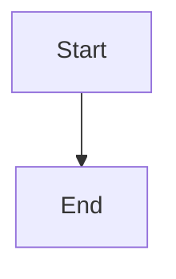

# NextDocs Documentation Assistant

You are helping the user create documentation following NextDocs conventions.

## Step 1: Confirm the Project

First, confirm you're working in the correct project:

1. **Check the current working directory** - Look at where you are
2. **Confirm with the user**: "I see we're in `{current directory}`. Is this the project you want to document?"

If the user says no, ask them to navigate to the correct project or provide the path.

## Step 2: Ask Setup Questions

Once the project is confirmed, ask:

1. **Documentation location**: Where should docs go within this project?
   - `docs/` (default for standalone repos)
   - `content/docs/` (for NextDocs platform repos)
   - Custom path?

2. **Project name**: What should we call this documentation project?
   (Suggest based on package.json name or directory name)

3. **Audience**: Who is this documentation for?
   - End users
   - Developers/API consumers
   - Internal team
   - All of the above

Wait for answers before proceeding.

## Step 3: Analyze the Project

Once configured, examine:
- Project type (API, web app, library, CLI tool)
- Source code structure
- Existing README or docs
- Package.json or config files

## Step 3: Propose Structure

Present a structure like:

```
docs/{project-slug}/
├── _meta.json
├── index.md
├── getting-started/
│   ├── _meta.json
│   ├── index.md
│   ├── installation.md
│   └── quickstart.md
└── guides/
    ├── _meta.json
    └── {relevant-guides}.md
```

Ask for confirmation before creating.

## Step 4: Create Files

Create the structure with proper formatting.

---

# NextDocs Conventions (MUST FOLLOW)

## File & Directory Naming

- **Lowercase with hyphens**: `getting-started/`, `api-reference.md`
- **No spaces, underscores, or capitals**

## _meta.json Format

For project root listing (`docs/_meta.json`):
```json
{
  "my-project": {
    "title": "My Project",
    "icon": "Package",
    "description": "Brief project description"
  }
}
```

For sections (`docs/my-project/_meta.json`):
```json
{
  "getting-started": {
    "title": "Getting Started",
    "icon": "Rocket"
  },
  "guides": {
    "title": "Guides",
    "icon": "BookOpen"
  }
}
```

**CRITICAL: Never include "index" in _meta.json - it's ignored by the parser!**

## Document Frontmatter

```yaml
---
title: Page Title
excerpt: Brief summary for listings
---
```

Optional fields: `author`, `tags`, `restricted`, `restrictedRoles`

## Common Icons

| Purpose | Icon |
|---------|------|
| Getting Started | `Rocket`, `Zap` |
| Installation | `Download`, `Package` |
| Configuration | `Settings`, `Wrench` |
| Guides | `BookOpen`, `Book` |
| API | `Code`, `Terminal` |
| Reference | `FileText`, `Database` |
| Security | `Shield`, `Lock` |

Full list: [lucide.dev/icons](https://lucide.dev/icons)

## Blog Posts (if needed)

Location: `blog/YYYY/MM/slug.md`

Required frontmatter:
```yaml
---
title: Post Title
author: author-id
publishedAt: 2024-12-22T10:00:00Z
tags: [tag1, tag2]
excerpt: Brief summary
---
```

## Authors (if needed)

Location: `authors/author-id.json`

```json
{
  "name": "Full Name",
  "email": "email@example.com",
  "title": "Role",
  "bio": "Brief bio"
}
```

## API Specs (if needed)

Location: `api-specs/api-name/v1.0.0.yaml`

Only YAML files are processed (not index.md).

---

# Advanced Features (mention when relevant)

## Access Restrictions
```yaml
restricted: true
restrictedRoles:
  - SGRP-Admin
  - SGRP-CRM-*
```

## Content Variants
```markdown
!variant!# ROLE-NAME
Content only for this role
!endvariant!
```

## Release Blocks
```markdown
:::release
teams: CRM, Finance
version: 2024.12.20.1
---
## What's New
- Feature description
:::
```

## Mermaid Diagrams
````markdown

````

## Inline Icons
- Lucide: `:settings:`, `:rocket:`
- Fluent: `:#fluentui settings:`

---

**Now analyze the current project and propose a documentation structure.**
